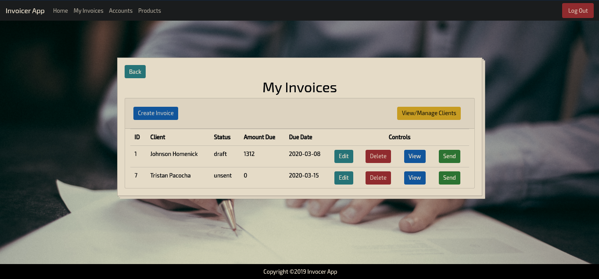

<!--
*** Thanks for checking out this README Template. If you have a suggestion that would
*** make this better, please fork the repo and create a pull request or simply open
*** an issue with the tag "enhancement".
*** Thanks again! Now go create something AMAZING! :D
-->


<!-- PROJECT SHIELDS -->
<!--
*** I'm using markdown "reference style" links for readability.
*** Reference links are enclosed in brackets [ ] instead of parentheses ( ).
*** See the bottom of this document for the declaration of the reference variables
*** for contributors-url, forks-url, etc. This is an optional, concise syntax you may use.
*** https://www.markdownguide.org/basic-syntax/#reference-style-links
-->
[![Contributors][contributors-shield]][contributors-url]
[![Forks][forks-shield]][forks-url]
[![Stargazers][stars-shield]][stars-url]
[![Issues][issues-shield]][issues-url]
[![MIT License][license-shield]][license-url]
[![LinkedIn][linkedin-shield]][linkedin-url]

![Ruby][ruby-shield]
![Rails][rails-shield]
![PostgreSQL][postgresql-shield]
![HTML5][html5-shield]
![Yarn][yarn-shield]

<!-- PROJECT LOGO -->
<br />
<p align="center">
  <a href="https://github.com/mikeg1440/Invoicer-App">
    
  </a>

  <h3 align="center">Invoicer App</h3>

  <p align="center">
    A simple invoice generator app that allows users to create accounts, clients and products/services and manage them from a single dashboard.  User's can sign in via Github using OmniAuth as well as the ability to send invoices from the dashboard if configured with a SendGrid API key.
    <br />
    <!-- <a href="https://github.com/mikeg1440/Invoicer-App"><strong>Explore the docs »</strong></a>
    <br /> -->
    <br />
    <a href="https://github.com/mikeg1440/Invoicer-App">View Demo</a>
    ·
    <a href="https://github.com/mikeg1440/Invoicer-App/issues">Report Bug</a>
    ·
    <a href="https://github.com/mikeg1440/Invoicer-App/issues">Request Feature</a>
  </p>
</p>


<!-- TABLE OF CONTENTS -->
## Table of Contents

* [About the Project](#about-the-project)
  * [Built With](#built-with)
* [Getting Started](#getting-started)
  * [Prerequisites](#prerequisites)
  * [Installation](#installation)
* [Usage](#usage)
* [Roadmap](#roadmap)
* [Contributing](#contributing)
* [License](#license)
* [Contact](#contact)
* [Acknowledgements](#acknowledgements)


<!-- ABOUT THE PROJECT -->
## About The Project

[![Product Name Screen Shot][product-screenshot]](https://example.com)

Ruby on Rails application using Object Oriented concepts and Model View Controller patterns that allows users to create,edit, and view invoices then email them to clients.  Clients have the ability to accept or decline the invoice which updates the status in the invoice dashboard. Implemented with Github OAuth sign in functionality to allow users to sign in with their existing Github account.


### Built With
This app was developed with these softwares and frameworks,  enhanced by a handful of gems and packages listed below.
* [Ruby on Rails](https://rubyonrails.org/)
  * [dotenv](https://github.com/bkeepers/dotenv)
  * [Puma](https://github.com/puma/puma)
  * [Devise](https://github.com/heartcombo/devise)
  * [Bootstrap 4](https://github.com/twbs/bootstrap-rubygem)
  * [Omniauth-Github](https://github.com/omniauth/omniauth-github)
  * [Sendgrid-Ruby](https://github.com/sendgrid/sendgrid-ruby)
  * [Time_Difference](https://github.com/tmlee/time_difference)
* [PostgreSQL](https://www.postgresql.org/)
* [NPM](https://www.npmjs.com/)
  * [Yarn](https://www.npmjs.com/package/yarn)

<!-- GETTING STARTED -->
## Getting Started

1. Clone the repo with this command `git clone https://github.com/mikeg1440/Invoicer-App`
2. Configure your PostgreSQL installation and set users credentials/permissions see [here for instruction](https://wiki.postgresql.org/wiki/First_steps)
3. Run migrations (see installation section)
4. Create a free [SendGrid account](https://signup.sendgrid.com/) and copy config details.
5. Configure action mailer with [sendgrid access](https://sendgrid.com/docs/for-developers/sending-email/rubyonrails/)
6. Configure access to Github API if you want to use GitHub OmniAuth login  
4. Run rails server `rails s`

### Prerequisites

This is an example of how to list things you need to use the software and how to install them.
* npm
```sh
npm install npm@latest -g
```

### Installation

Need to set up postgresql db first
 - `sudo su postgres`
 - `createuser --interactive --pwprompt` => to create a new user for postgresql 
 - add a `.env` file to root directory and set the db password like this
 ```
 DATABASE_USER=<DB_USER_HERE>
 DATABASE_PASSWORD=<DB_PASSWORD_HERE>
 ```

#### NOTE - if you get a message about yarn integrity not found or something similar then you can fix it by adding this line `config.webpacker.check_yarn_integrity = false` to the `/config/environments/development.rb` file, I put it at the bottom but idk if it matters.

Now we need to create the db before we can run migrations
 - `rails db:create`
 - `rails db:migrate`
 -  if you want to test then seed the db `rails db:seed`
 - then to run tests do `rspec`


<!-- USAGE EXAMPLES -->
## Usage

Use this space to show useful examples of how a project can be used. Additional screenshots, code examples and demos work well in this space. You may also link to more resources.

_For more examples, please refer to the [Documentation](https://example.com)_


<!-- ROADMAP -->
## Roadmap

See the [open issues](https://github.com/mikeg1440/Invoicer-App/issues) for a list of proposed features (and known issues).

### Project Todo List

 - Add additional OmniAuth options
 - Restrict access of client information for users (only users that created clients can view those clients)
 - Fix formatting of sent email so that it looks just like the HTML rendering of invoice


<!-- CONTRIBUTING -->
## Contributing

Contributions are what make the open source community such an amazing place to be learn, inspire, and create. Any contributions you make are **greatly appreciated**.

1. Fork the Project
2. Create your Feature Branch (`git checkout -b feature/AmazingFeature`)
3. Commit your Changes (`git commit -m 'Add some AmazingFeature'`)
4. Push to the Branch (`git push origin feature/AmazingFeature`)
5. Open a Pull Request


<!-- LICENSE -->
## License

Distributed under the MIT License. See [LICENSE](LICENSE.txt) for more information.


<!-- CONTACT -->
## Contact

Michael Gaudreau - [@MyLogicBytes1](https://twitter.com/MyLogicBytes1) - cyberct@kbox.li

Project Link: [https://github.com/mikeg1440/Invoicer-App](https://github.com/mikeg1440/Invoicer-App)


<!-- ACKNOWLEDGEMENTS -->
<!-- ## Acknowledgements
* [GitHub Emoji Cheat Sheet](https://www.webpagefx.com/tools/emoji-cheat-sheet)
* [Img Shields](https://shields.io)
* [Choose an Open Source License](https://choosealicense.com)
* [GitHub Pages](https://pages.github.com)
* [Animate.css](https://daneden.github.io/animate.css)
* [Loaders.css](https://connoratherton.com/loaders)
* [Slick Carousel](https://kenwheeler.github.io/slick)
* [Smooth Scroll](https://github.com/cferdinandi/smooth-scroll)
* [Sticky Kit](http://leafo.net/sticky-kit)
* [JVectorMap](http://jvectormap.com)
* [Font Awesome](https://fontawesome.com) -->


<!-- MARKDOWN LINKS & IMAGES -->
<!-- https://www.markdownguide.org/basic-syntax/#reference-style-links -->
[contributors-shield]: https://img.shields.io/github/contributors/mikeg1440/Invoicer-App.svg?style=plastic
[contributors-url]: https://github.com/mikeg1440/Invoicer-App/graphs/contributors
[forks-shield]: https://img.shields.io/github/forks/mikeg1440/Invoicer-App.svg?style=plastic
[forks-url]: https://github.com/mikeg1440/Invoicer-App/network/members
[stars-shield]: https://img.shields.io/github/stars/mikeg1440/Invoicer-App.svg?style=plastic
[stars-url]: https://github.com/mikeg1440/Invoicer-App/stargazers
[issues-shield]: https://img.shields.io/github/issues/mikeg1440/Invoicer-App.svg?style=plastic
[issues-url]: https://github.com/mikeg1440/Invoicer-App/issues
[license-shield]: https://img.shields.io/github/license/othneildrew/Best-README-Template.svg?style=plastic
[license-url]: https://github.com/mikeg1440/Invoicer-App/blob/master/LICENSE.txt
[linkedin-shield]: https://img.shields.io/badge/-LinkedIn-black.svg?style=plastic&logo=linkedin&colorB=555
[linkedin-url]: https://linkedin.com/in/michael-gaudreau
[product-screenshot]: images/screenshot.png

<!-- Built With Badges -->
[ruby-shield]: https://img.shields.io/static/v1?label=Built%20With&message=Ruby&color=blue&logo=ruby
[rails-shield]: https://img.shields.io/static/v1?label=Built%20With&message=Rails&color=blue&logo=rails
[postgresql-shield]: https://img.shields.io/static/v1?label=Built%20With&message=PostgreSQL&color=blue&logo=postgresql
[html5-shield]: https://img.shields.io/static/v1?label=Built%20With&message=HTML5&color=blue&logo=html5
[yarn-shield]: https://img.shields.io/static/v1?label=Built%20With&message=Yarn&color=blue&logo=yarn
